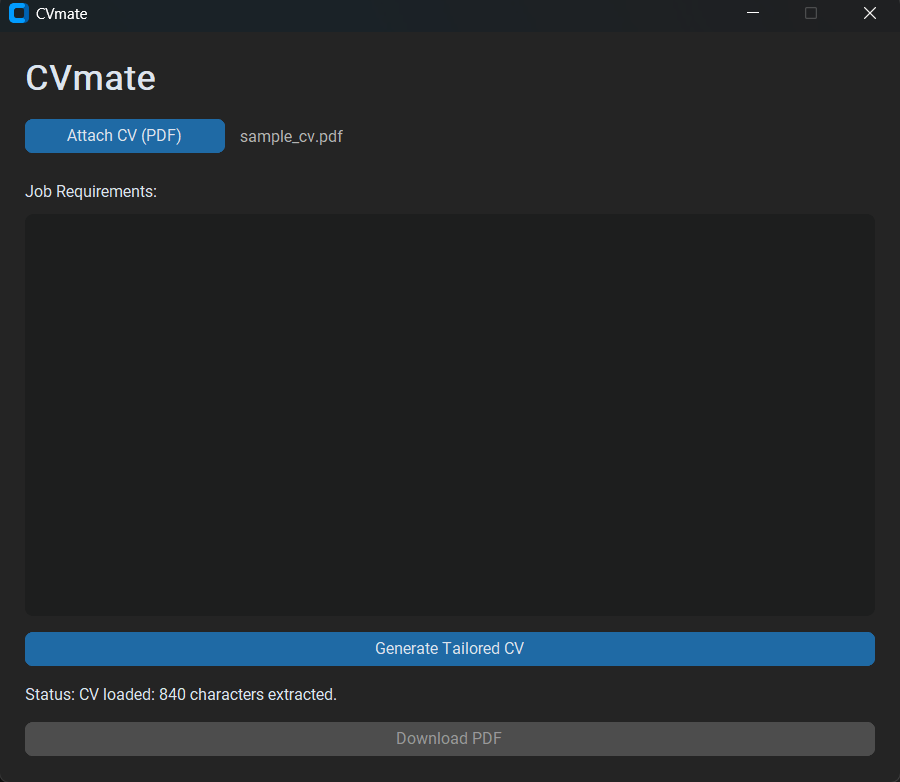
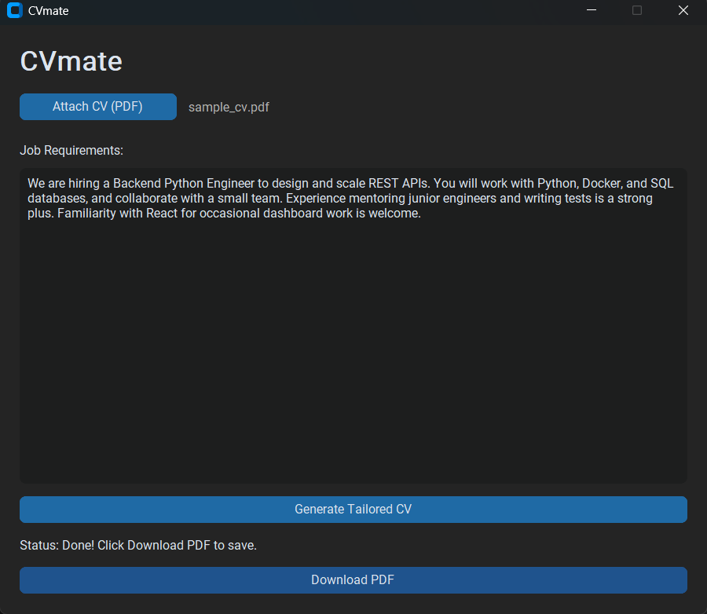
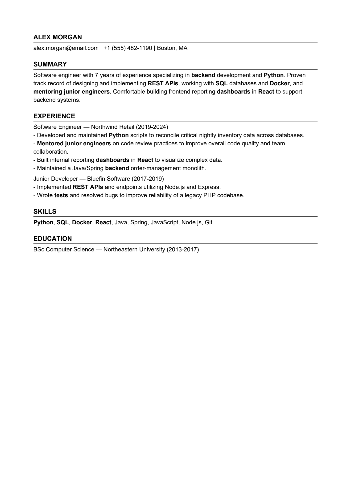

# CVmate

A local Windows desktop tool that tailors your CV to a specific job. Attach your CV as a
PDF, paste a job description, click **Generate**, and CVmate uses Google Gemini to rewrite
the CV to emphasize the experience most relevant to that role — then exports a clean PDF.

Everything runs locally. Nothing is stored, no accounts, no database. The only data that
leaves your machine is the CV text and job description sent to the Gemini API on Generate.

> **No fabrication:** Gemini is explicitly instructed to use only information already
> present in your CV — it reorders and rephrases, it does not invent skills or experience.

---

## Screenshots

| Attach a CV + paste the job | Tailored result, ready to download |
|---|---|
|  |  |

The exported PDF, reordered to lead with the most job-relevant experience:



A full step-by-step walkthrough is in [showcase/SHOWCASE.md](showcase/SHOWCASE.md).

---

## Quick start (no Python, no terminal)

For most users — nothing to install:

1. Go to the [**Releases**](https://github.com/MetaCodeMax/CVmate/releases) page and download **`CVmate.exe`**.
2. Double-click it. (Windows SmartScreen may warn about an unknown publisher — click **More info → Run anyway**; the app is unsigned.)
3. On first launch CVmate asks for a free Google Gemini API key:
   - Click **Open Google AI Studio**, sign in, press **Create API key**, and copy it.
   - Paste it into the box and click **Save & Continue**.
   - The key is validated and stored locally at `%APPDATA%\CVmate\config.json` — you only do this once. (Change it any time via the **API Key** button.)
4. Attach your CV, paste a job description, **Generate**, then **Download PDF**.

> The key lives only on your machine. Nothing is uploaded except the CV text and
> job description sent to Gemini when you click Generate.

---

## Features

- **Attach CV (PDF)** — extracts text from text-based PDFs (`pdfplumber`).
- **Paste job description** — free-form text, no length limit.
- **Generate tailored CV** — Gemini rewrites the CV to match the job (runs in a background
  thread, so the UI never freezes).
- **Download PDF** — clean, single-column A4 layout (`reportlab`).

---

## Requirements

- **Windows 11**
- **Python 3.11+** (developed and verified on 3.13)
- A **Google Gemini API key** — free from [Google AI Studio](https://aistudio.google.com/apikey)

---

## Run from source (developers)

```powershell
# 1. Clone
git clone https://github.com/MetaCodeMax/CVmate.git
cd CVmate

# 2. (Recommended) create a virtual environment
py -m venv .venv
.\.venv\Scripts\Activate.ps1

# 3. Install dependencies
py -m pip install -r requirements.txt

# 4. Run
py main.py
```

> The `py` launcher selects your Python 3.11+ interpreter. If `python` on your machine
> points at the Microsoft Store stub, use `py` instead (as shown above).

On first launch the app prompts for your Gemini API key in a window and saves it to
`%APPDATA%\CVmate\config.json` — no `.env` editing required.

> **Optional dev shortcut:** to skip the dialog, `copy .env.example .env` and set
> `GEMINI_API_KEY=your-real-key-here`. A key in the environment or `.env` always takes
> precedence over the saved config.

---

## Build the standalone .exe

To produce a single-file `dist\CVmate.exe` that runs without Python installed:

```powershell
.\build.bat
```

This installs [PyInstaller](https://pyinstaller.org/) and bundles everything per
`CVmate.spec`. The resulting `dist\CVmate.exe` is fully self-contained — share that one
file, or attach it to a [GitHub Release](https://github.com/MetaCodeMax/CVmate/releases):

```powershell
gh release create v1.0.0 dist\CVmate.exe --title "CVmate v1.0.0" --notes "Standalone Windows build."
```

---

## Using the app

1. Click **Attach CV (PDF)** and select a text-based PDF.
2. Paste the job description into the text area.
3. Click **Generate Tailored CV** and wait for the status to read *Done!*
4. Click **Download PDF** and choose where to save.

---

## Project structure

```
CVmate/
├── main.py            # Entry point: loads dev .env, then launches the GUI
├── gui.py             # CustomTkinter window, first-run API-key dialog, handlers
├── cv_parser.py       # extract_text(), segment_sections()
├── gemini_client.py   # configure(), validate_api_key(), build_prompt(), generate_tailored_cv()
├── key_store.py       # Resolve/save the API key (%APPDATA%\CVmate\config.json)
├── pdf_exporter.py    # export_pdf()
├── config.py          # GEMINI_MODEL, APP_TITLE, WINDOW_SIZE, AI_STUDIO_URL
├── requirements.txt   # 5 runtime dependencies
├── build.bat          # One-click build → dist\CVmate.exe
├── CVmate.spec        # PyInstaller bundle spec
├── .env.example       # Optional dev template — copy to .env and add your key
├── PRD.md             # Product requirements
└── MVP-PLAN.md        # Phase-by-phase build plan
```

Each logic module (`cv_parser`, `gemini_client`, `pdf_exporter`) has a `__main__` block so
it can be verified on its own:

```powershell
py cv_parser.py path\to\cv.pdf
py gemini_client.py
py pdf_exporter.py
```

---

## Configuration

`config.py` holds the model name and UI constants — change the Gemini model in one place:

```python
GEMINI_MODEL = "gemini-flash-latest"
```

---

## Security notes

- Your API key is stored only on your machine — in `%APPDATA%\CVmate\config.json`
  (entered via the in-app dialog) or in a developer `.env`. Neither is committed.
- **`.env` is gitignored** and must never be committed.
- `.env.example` is the committed template and contains only a placeholder.
- If your key is ever exposed, revoke it at
  [Google AI Studio](https://aistudio.google.com/apikey) and generate a new one.

---

## Tech stack

| Layer | Library |
|---|---|
| GUI | `customtkinter` |
| PDF parsing | `pdfplumber` |
| AI | `google-generativeai` (Gemini) |
| PDF export | `reportlab` |
| Config | `python-dotenv` |

---

## License

Personal project — no license specified. All rights reserved by the author.
