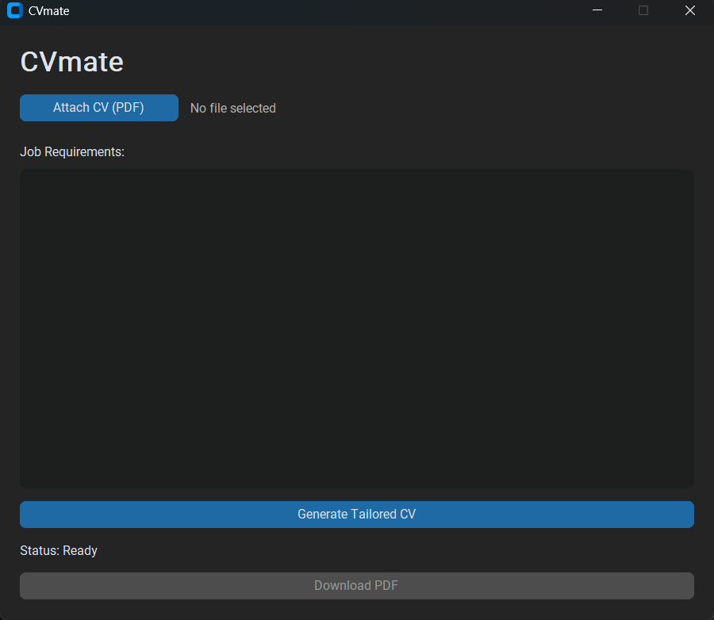
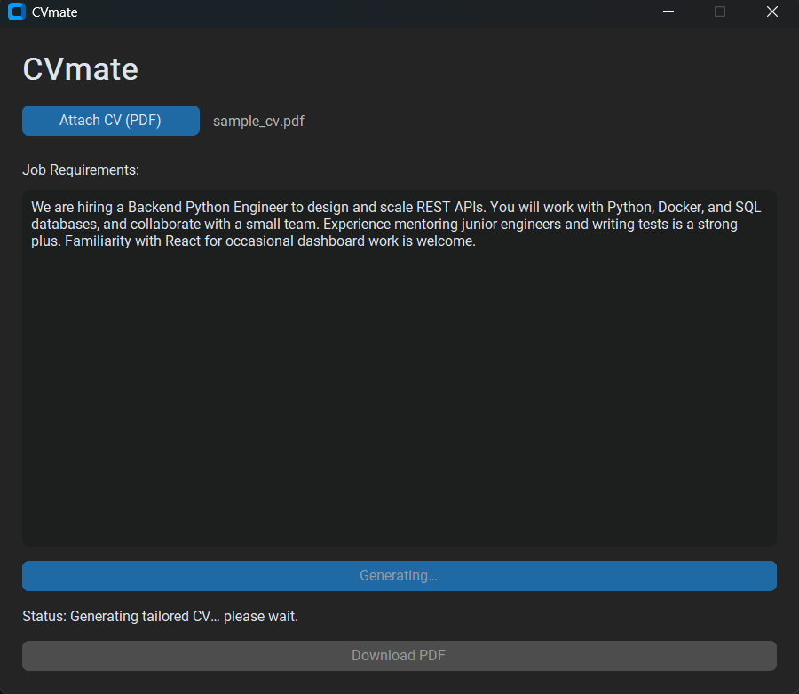
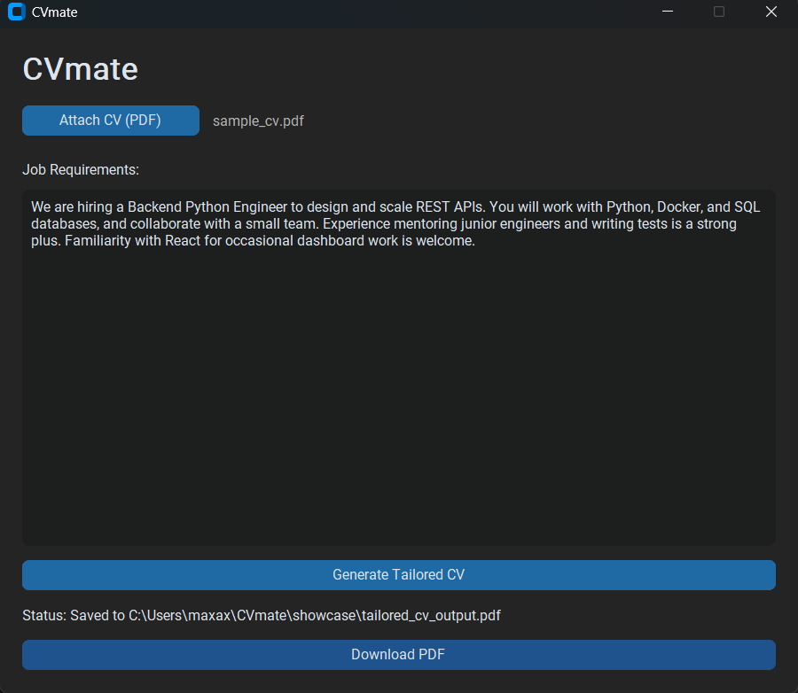

# CVmate — Showcase

A full walkthrough of CVmate tailoring a CV to a job description, end to end. Every
screenshot below is from the real app driving the real Gemini API and the real PDF
exporter — nothing is mocked.

The example uses a sample CV for a generalist engineer (`sample_cv.pdf`) and a **Backend
Python Engineer** job description. Watch how the output is reordered to lead with the
most relevant experience — without inventing anything.

---

## 1. Launch

The app opens in dark mode. Download is disabled until a CV is generated.

## 2. Attach a CV

Pick a text-based PDF. The filename and extracted character count appear in the status bar.

## 3. Paste the job description

## 4. Generate

The Gemini call runs on a background thread, so the window never freezes. The button
shows **Generating…** while it works.

## 5. Done

When the rewrite returns, the status updates and **Download PDF** becomes active.

## 6. Download

Save the tailored CV anywhere; the status bar confirms the path.

## 7. The result

A clean, single-column A4 PDF. Compare it to the source:

- The **summary** is rewritten to target the exact role and leads with *Python* and backend.
- **Experience** bullets are reordered to surface Python scripting and mentoring — both
  called out in the job description — ahead of the Java/monolith work, each rewritten to
  open with a strong action verb.
- **Skills** lead with *Python, SQL, Docker, React* (the job's keywords).
- Phrases that are **both** in the CV **and** a job requirement are rendered in **bold**, so the
  match is visible at a glance.
- Nothing was added. Every line traces back to the original CV.

